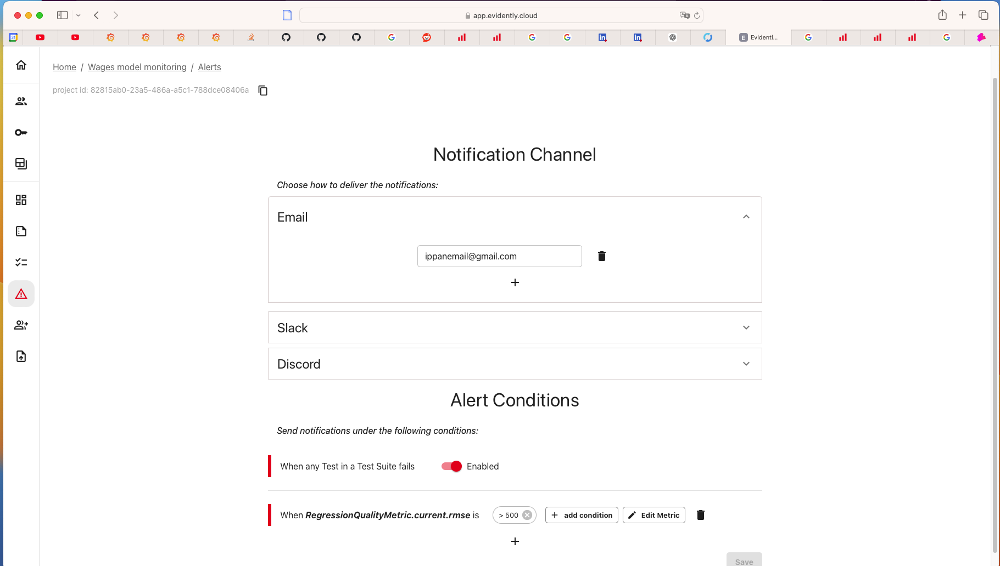

# MLOps Project

# Problem Description: Wages Prediction Model Pipeline

## Objective
The goal of this project is to develop a machine learning pipeline that predicts weekly earnings (`earnweek`) based on various features from a subset of the American Time Use Survey (2003-2022). The pipeline is orchestrated using Prefect and integrates several key technologies including Scikit-Learn for model training, MLflow for experiment tracking and model management, Prefect for workflow orchestration, Evidently AI for data and model monitoring, DigitalOcean for data storage and model deployment.

## Pipeline Workflow


## Technologies and Tools

- **Pandas**: For data manipulation and preparation.
- **Scikit-Learn**: For data preprocessing, model training, and evaluation.
- **MLflow**: For experiment tracking, model management, and registry.
- **Prefect Cloud**: For orchestrating the entire machine learning workflow, managing tasks, and ensuring smooth execution of each step.
- **Boto3**: For interacting with DigitalOcean Spaces to download and upload data files.
- **Evidently AI Cloud**: For monitoring and analyzing machine learning models in production to ensure their performance and stability over time.
- **Flask and gunicorn**: For the model to be deployed as a web service on a Digitalocean droplet.

## Clone repository from GitHub

- clone repository

```bash
git clone git@github.com:Kolpashnikova/mlops-project.git
```

## Set up a new conda environment for Python 3.9

- this is recommended (can skip at your own risk)

## Environment setting

- install packages from `requirements.txt`

```bash
pip install -r requirements.txt
```

- alternatively install full environment packages (not recommended)

```bash
pip install -r requirements_freeze.txt
```

## Test the model straight away

- run the following to test the model deployed on Digitalocean. The server I'm using is the cheapest (smallest) one, so response my take some time.

```bash
python scripts/test_prediction_webservice.py
```

## Download data from a bucket

- download data from a public bucket `https://mlops-project.nyc3.digitaloceanspaces.com`


## Set up Mlflow and login into your Prefect

- start Mlflow

```bash
mlflow ui --backend-store-uri sqlite:///mlflow.db
```

- start prefect cloud (login)

```bash
prefect cloud login
```

## Run the flow

- start a worker

```bash
prefect worker start -p my-pool -t process
```
- define a deployment
- use `main_flow_prefect.py`

```bash
prefect deploy main_flow_prefect.py:run_script -n 'mlops-deployment' -p my-pool
```

- run your deployment from Prefect Cloud or

```bash
prefect deployment run mlops-deployment
```

You will get the following deployment flow run output:


If you go to your deployments tab on Prefect Cloud, you will see the following:


## Hyperparameter Tuning

- the hyperparameter tuning can be integrated into the `main_flow_prefect.py` but it will take quite some time, so it is separated in the project.

- run hyperparameter optimization (you can skip this step as all this is already logged in Mlflow and the data for Mlflow is included with the project)

```bash
python scripts/optimize_hyperparameters.py
```
You will see the following logged into your Mlflow:


- register models (you can skip this step because everything is already logged and data for Mlflow is provided with the project)


If you mess up, you can see the original on the Digitalocean droplet (find IP address in `test_prediction_webservice.py` and add port 5000, like so [IP]:5000). This will take quite some time to load because again I'm using the slowest droplet as it's the cheapest as well.

## Data and model monitoring

- for this you need the following environmental variables in your environment (make sure you get them from your EvidentlyAI Cloud):
```python
EVIDENTLY_API_KEY = os.getenv('EVIDENTLY_API_KEY')
EVIDENTLY_TEAM_ID = os.getenv('EVIDENTLY_TEAM_ID')
```
- run `monitor_model.py`

```bash
python scripts/monitor_model.py
```

- login into your EvidentlyAi Cloud and you will see the following dashboard:


- set up alert to the developer if model doesn't perform as good (here is the screenshot how to do it):



## Dockerization of the Model

You can try and run the model on your own machine (if you don't want to use the cloud version -- also the cloud version will not be available after this project is reviewed). Using the following, you can 1) run only the model in docker, 2) run the model and mlflow in docker.

### 1) Run the Dockerized Model

- build docker image from Dockerfile:

```bash
docker build -t wage-prediction:v1 .
```

- run the Docker image with the model:

```bash
docker run -it -p 9696:9696 wage-prediction:v1
```

- run test script to test if it's doing its job:

```bash
python scripts/test_prediction.py
```

### 2) Dockerized Version of the Model + Mlflow

This will copy the experiments that are already present into the docker container. If new experiments are run, then they will be in the docker container, not on the local machine.

- remove all containers and images
```bash
docker rm -vf $(docker ps -aq)
docker rmi -f $(docker images -aq)
```

- compose docker images
```bash
docker-compose up -d --build
```

## Best Practices Implemented

[x] There are unit tests (1 point)
[ ] There is an integration test (1 point)
[x] Linter and/or code formatter are used (1 point)
[x] There's a Makefile (1 point)
[x] There are pre-commit hooks (1 point)
[ ] There's a CI/CD pipeline (2 points)

### Unit test

- tests/test_model.py

### Pylint

- added ```pyproject.toml``` file to suppress inutile Pylint messages

- now run checks (should get 10.00/10):

```bash
pylint --recursive=y scripts/
```
### Makefile

- makefile ```Makefile``` in the main dir

## Thank you

Thank you for reviewing my project! All the best on your Mlops journey!
